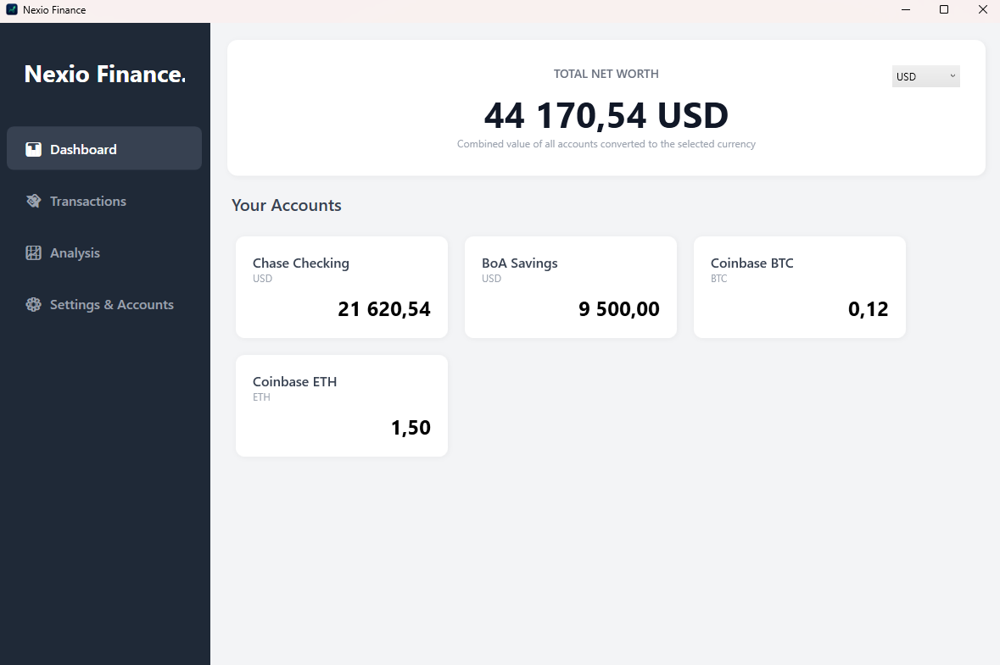
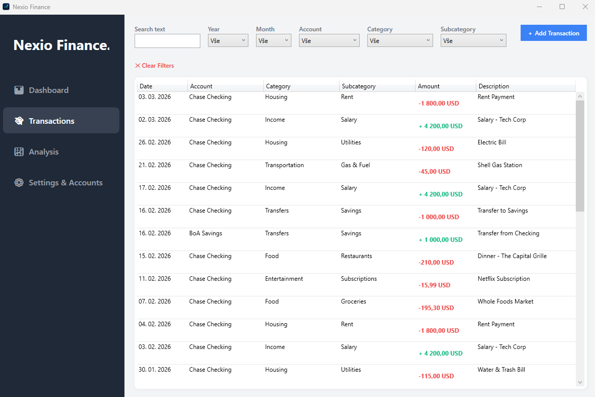
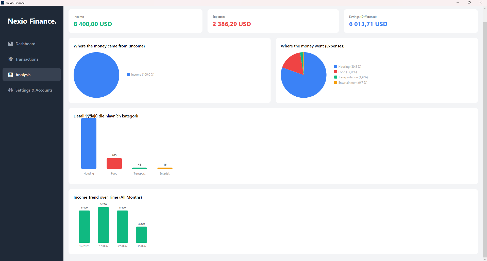

# Nexio Finance 📊

**Nexio Finance** is a modern, powerful, and user-friendly Personal Finance Manager built for Windows desktop. It helps you track your wealth, analyze your spending habits, and manage multiple accounts seamlessly—bridging the gap between traditional fiat currencies and cryptocurrencies.

## 📸 Screenshots

| Dashboard | Transactions |
|:---:|:---:|
|  |  |

| Analysis & Charts |
|:---:|
|  |

## ✨ Key Features

* **Multi-Currency & Crypto Support:** Manage accounts in USD, EUR, CZK, or even Bitcoin and Ethereum. The dashboard automatically calculates your total net worth into your selected base currency using real-time (user-defined) exchange rates.
* **Smart Dashboard:** Get a quick overview of your total wealth and individual account balances.
* **Deep Analytics:** Visualize your cash flow with interactive pie charts for expenses/incomes and a historical trend bar chart to track your financial growth over time.
* **Advanced Transaction Management:** Log incomes, expenses, and track internal transfers between your own accounts.
* **Category Tree:** Organize your spending with unlimited main categories and subcategories.
* **Data Portability:** Complete data backup and restore via JSON. Export and import your transactions using CSV (Excel) for easy bank statement integration.
* **Bilingual UI:** Native support for English (default) and Czech languages.

## 🛠️ Built With

* **Framework:** .NET 9.0 SDK
* **UI:** WPF (Windows Presentation Foundation)
* **Database:** Entity Framework Core (Local database setup)
* **Architecture:** C# / XAML

## 🚀 Getting Started

These instructions will get you a copy of the project up and running on your local machine for development and testing purposes.

### Prerequisites

To run this application, you will need:
* **Visual Studio 2022** (Community, Professional, or Enterprise)
* **.NET 9.0 SDK** (Installed via Visual Studio Installer)

### Installation & Running

1. **Clone the repository:**
   ```sh
   git clone [https://github.com/YOUR_USERNAME/NexioFinance.git](https://github.com/YOUR_USERNAME/NexioFinance.git)